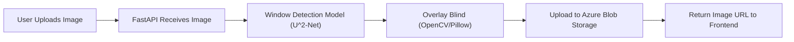

# Blinds & Boundaries App

A web application that allows users to virtually try on blinds and window coverings on their own windows, patios, or other spaces by uploading images. The app uses AI/ML to detect window areas and overlays selected blinds from the inventory, providing a realistic preview experience similar to Google’s try-on features for clothes or lenses.

---

## Features
- Upload images of windows, patios, or other spaces
- AI/ML-powered window detection in uploaded images
- Select blinds from inventory (color, texture, style)
- Realistic overlay of blinds onto detected window area
- Processed images stored and served via Azure Blob Storage
- (Planned) Measurement prediction and plugin integration

---

## Tech Stack
- **Frontend:** React (with Material-UI or Chakra UI)
- **Backend:** FastAPI (Python)
- **AI/ML:** U^2-Net or DeepLab for window segmentation, OpenCV/Pillow for image processing
- **Storage:** Azure Blob Storage
- **(Optional):** PostgreSQL for user/inventory management, Docker for deployment

---

## Architecture



---

## Setup Instructions

### 1. Backend (FastAPI)
- Install Python 3.8+
- Create a virtual environment:
  ```bash
  python -m venv venv
  source venv/bin/activate  # On Windows: venv\Scripts\activate
  ```
- Install dependencies:
  ```bash
  pip install fastapi uvicorn pillow opencv-python azure-storage-blob
  # Add torch, torchvision, and segmentation model dependencies as needed
  ```
- Set up Azure credentials for Blob Storage (see Azure documentation)
- Run the FastAPI server:
  ```bash
  uvicorn app.main:app --reload
  ```

### 2. Frontend (React)
- Install Node.js (v16+ recommended)
- Create React app:
  ```bash
  npx create-react-app blinds-boundaries-frontend
  cd blinds-boundaries-frontend
  npm install @mui/material @emotion/react @emotion/styled axios
  ```
- Start the development server:
  ```bash
  npm start
  ```

---

## Key Backend Functions
- **/upload-image**: Receives image, triggers window detection and overlay
- **detect_window(image_path)**: Runs segmentation model to find window area
- **overlay_blind(image, window_mask, blind_style)**: Overlays selected blind
- **upload_to_azure(image_path)**: Uploads processed image to Azure Blob Storage
- **/result/{image_id}**: Returns processed image URL

---

## Roadmap
- [x] Image upload and processing pipeline
- [x] Window detection with AI/ML
- [x] Overlay logic for blinds
- [x] Azure Blob Storage integration
- [ ] Frontend UI for blind selection and preview
- [ ] Measurement prediction plugin
- [ ] User authentication and inventory management
- [ ] Deployment (Docker/Azure App Service)

---

## License
MIT 